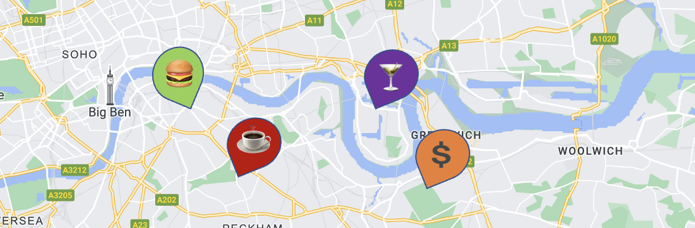

# Foursquare Venue Scraper 2023

## What is it? 
**Four_Square_Venue_Search.ipynb** is a Jupyter notebook (coded in python) that exhaustively searches a custom geographic area for all venues (e.g. bars, restaurants, businesses etc.) in the area according to the Foursquare Business Directory. 

It uses the **Place Search** Foursquare API to find all venues in the area and uses the **Get Place Details** Foursquare API to get extended data on each venue (e.g. popularity, footfall, rating, price etc.). 

## What’s special about it?
-  **Exhaustive Search** - other approaches typically fail to find all venues in high density areas because the API only returns a maximum of 50 results. We use a dynamically changing search radius (i.e. smaller search radius for higher density areas) to ensure all venues are found. 
- **Custom search area** - use latitude and longitude coordinates to define any desired area to search (in the world!).  
- **Effectively Free** - A search for all bars and restaurants in London costs about ~$100. Foursquare developer accounts get $200 free credit a month. 
- **Find Specific Venue Types** - Customise the type of venues to search for e.g. all businesses or just bars and restaurants etc. 
- **Balanced speed against number of API calls** - we made the search as fast as possible whilst making as few API calls as possible.   
- **Tailor Data** - Can customise what extended venue data is collected via a small amount of code tweaking. 
- **Dynamic Tracker** - Track progress of search via a dynamically updated map of the search area (showing area still to be searched).  

- **Retrofit Different API** - Easy to retrofit a different API to exhaustively search an area e.g. Google Maps. 

## How does it work?
The **Four_Square_Venue_Search.ipynb** notebook contains a detailed explanation on how the venue search works and tips for using it. 

## How do I set up and perform the Search? 
Set up API Access: 
1. Create a foursquare developer account [here](https://location.foursquare.com/developer/) (free to create).
2. Create a new project (from your Foursquare Developer account).
3. Generate a new API key for your project.
4. Create a file called key.txt that contains the key you just generated. Save this file in the same folder as Four_Square_Venue_Search.ipynb

Perform Custom Search in Jupyter notebook:
1. Create virtual environment from requirements.txt file
2. Open **Four_Square_Venue_Search.ipynb** (using the virtual environment)
3. Enter your desired geographic area (defined by a maximum and minimum latitude and longitude) in the **Define Geographic Area** section of the notebook.
4. Review the **Setting Search Arguments** section of notebook to understand how to customise your search (e.g. what category of venues to search for). 
5. Enter your custom search paramaters in the **Perform Venue Search** section. 
6. Run all cells, the results will be saved to csv.

## Output 
The output file is a CSV with the following fields:

Field|Description
:---:|:---
fsq_id|Unique Foursquare ID for venue
venue_name|Name of venue
latitude|Laititude Coordinate of venue
longitude|Longitude Coordinate of venue
email|contact email address of venue
tel|contact telephone number of venue
website|website of venue
verified|A boolean that indicates whether or not the FSQ Place has been claimed.
rating|A numerical rating (from 0.0 to 10.0) of the FSQ Place, based on user votes, likes/dislikes, tips sentiment, and visit data. Not all FSQ Places will have a rating.
popularity|Measure of the FSQ Place's popularity, by foot traffic. This score is on a 0 to 1 scale and uses a 6-month span of POI visits for a given geographic area.
price|A numerical value (from 1 to 4) that best describes the pricing tier of the FSQ Place, based on known prices for menu items and other offerings. Values include: 1 = Cheap, 2 = Moderate, 3 = Expensive, and 4 = Very Expensive
date_closed|The recorded date when the FSQ Place was marked as permanently closed in Foursquare's databases. This does not necessarily indicate the POI was actually closed on this date.
categories|An array, possibly empty, of categories that describe the FSQ Place. Stored as a list of strings. 
total_ratings|Total number of ratings for venue 
parent|If the venue is owned by a parent venue, the parent venue's name will be listed 
parent_fsq_id|If the venue is owned by a parent venue, the parent venue's foursquare ID will be listed 
neighborhood|Description of the neighborhood the venue is located in e.g. 'Clapham'.
