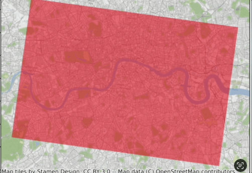

# Foursquare Venue Scraper 2023

## What is it? 
**Four_Square_Venue_Search.ipynb** is a Jupyter notebook that exhaustively searches a custom geographic area for all venues (e.g. bars, restaurants, businesses etc.) in the area according to the Foursquare Business Directory. 

It uses the **Place Search** Foursquare API to find all venues in the area and uses the **Get Place Details** Foursquare API to get extended data on each venue (e.g. popularity, footfall, rating, price etc.). 

## What’s special about it?
-  This is a properly **exhaustive search** - other approaches typically fail to find all venues in high density areas because the API only returns a maximum of 50 results. We use a dynamically changing search radius (i.e. smaller search radius for higher density areas) to ensure all venues are found. 
- We tried to balance the speed to the search against the number of API calls made i.e. we made the search as fast as possible whilst making a small number of API calls  
- Easily choose category of results e.,g. Any business or just bars and restaurants
- Easily update data pulled back by tweaking the venue details function
- Nice update tracker to track progress (show pic)
- Easy to retrofit another API call if you wanted to exhaustively search an area using a different API or function e.g. Google Maps

## How to set up 

Foursquare Account: 
- Key file + Foursquare Account
Setting Parameters in Jupyter File: 
- Define Geographic Area
- Categories List
- Tune Search Parameters (Initial Search Radius, time between updates)
- Choose whether to use multi search (gets an extra maybe 10% or fewer venues, but makes far more calls and runs for many times longer e.g. maybe 10x more)
- Run all and spit out results

Output: 
The output file is a CSV with the following fields:
	•	id — The Foursquare ID for the venue.
	•	name — The name of the venue.
	•	categories — The list of categories of the venue.
	•	lat — Latitude
	•	long — Longitude
	•	num_checkins — Number of Foursquare Checkins
	•	num_likes — Number of Foursquare Likes
	•	price — Price Tier between 1-4 (i.e. −

$$$)
	•	rating — Rating for the venue.
	•	num_ratings — Number of ratings for the venue.
	•	url_venue — URL of the venue.
	•	url_foursquare — URL for the Foursquare venue.
